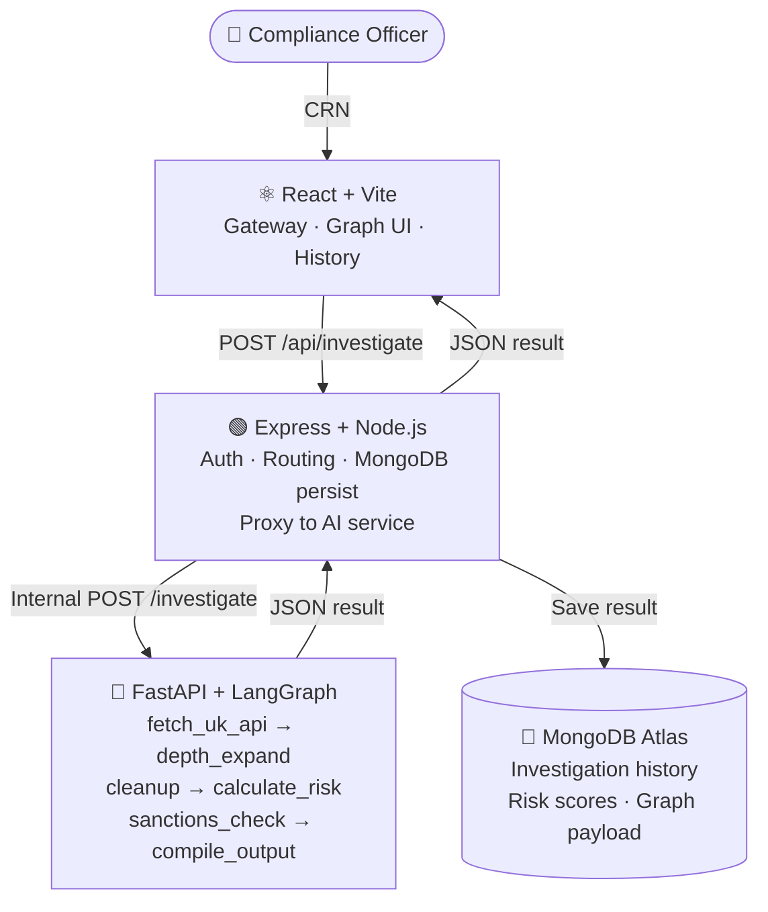
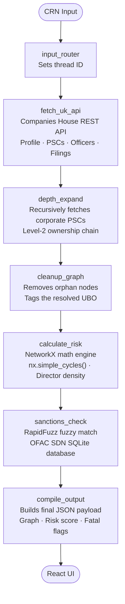

# 🔍 Unshell
### Autonomous AML & KYB Intelligence Graph

> **MERN + Python AI Microservice Architecture**

[](https://nodejs.org)
[](https://react.dev)
[](https://mongodb.com)
[](https://fastapi.tiangolo.com)
[](https://langchain-ai.github.io/langgraph/)

---

## What is Unshell?

Financial criminals hide behind **layers of shell companies, nominee directors, and offshore trusts** — making it nearly impossible for a compliance analyst to trace the real beneficial owner.

**Unshell** is a fully autonomous AML & KYB (Know Your Business) investigation platform. Give it a UK Company Registration Number. It returns a **complete, evidence-backed forensic ownership graph** — with risk scores, sanctions flags, and circular loop detection — in seconds.

> A task that takes a senior compliance analyst **3 days** takes Unshell less than **10 seconds**.

---

## Architecture

```
React (Vite) — Port 5173
       │  REST API (CORS enabled)
       ▼
Node.js + Express — Port 5000     ◄── MongoDB Atlas
       │  Internal HTTP (server-to-server, no CORS)
       ▼
Python AI Microservice — Port 8000
   ├── LangGraph 6-node pipeline
   ├── Companies House API (depth-2 expansion)
   ├── NetworkX risk engine
   └── OFAC sanctions check
```

**Key principle:** React only ever calls Express. Express is the single public-facing API. The Python AI service is internal — never exposed to the browser.

---

## System Diagram



---

## LangGraph Investigation Pipeline

The AI pipeline runs as a **6-node LangGraph stateful workflow**:



---

## Risk Scoring Engine

The `NetworkX` graph engine runs deterministic risk vectors — pure math, zero AI opinion:

| Flag | Trigger | Score Impact |
|---|---|---|
| `CIRCULAR_LOOP` | `nx.simple_cycles()` detects ownership cycle | +100 (Fatal) |
| `NOMINEE_PUPPET` | Director appointed across 100+ companies | +75 (Fatal) |
| `OFAC_MATCH` | RapidFuzz match on US Treasury SDN list | Score → 100 |
| `OFFSHORE_WALL` | PSC jurisdiction outside UK/EEA | +30 |
| `AGED_SHELL` | Incorporation >10yrs, <5 filings | +15 |
| `VAGUE_SIC` | High-risk SIC code (74990, 99999) | +10 |

**Score thresholds:** `< 30` Auto-Approve · `30–64` Human Review · `65–94` Auto-Reject · `≥ 95` SAR Filing Required

---

## Tech Stack

| Layer | Technology |
|---|---|
| **Frontend** | React 18 + Vite, React Flow (ownership graph), vanilla CSS |
| **Express Backend** | Node.js + Express, Mongoose, Multer, Axios |
| **Database** | MongoDB Atlas (investigation history persistence) |
| **AI Microservice** | FastAPI + asyncio, Uvicorn |
| **Orchestration** | LangGraph (stateful 6-node workflow) |
| **Graph Math** | NetworkX (topology, cycle detection, centrality) |
| **PDF Reading** | PyMuPDF + FAISS + Sentence Transformers (RAG) |
| **AI Extraction** | NVIDIA NIM Mistral (structured entity extraction) |
| **Verification** | RapidFuzz token-sort firewall (Zero-Trust AI) |
| **Sanctions** | SQLite OFAC SDN database (local, offline) |

---

## Project Structure

```
unshell/
├── frontend/                    # React + Vite UI
│   ├── src/
│   │   ├── App.jsx
│   │   ├── api/client.js        # Express API calls
│   │   └── components/
│   │       ├── DualEntryGateway.jsx   # Landing / CRN input + history
│   │       ├── HistoryPanel.jsx       # Past investigations from MongoDB
│   │       ├── LoadingScreen.jsx      # Pipeline progress UI
│   │       ├── InvestigationView.jsx  # Main forensic dashboard
│   │       ├── GraphCanvas.jsx        # React Flow graph
│   │       ├── CustomNode.jsx         # Graph node component
│   │       ├── EntitySidebar.jsx      # Node list sidebar
│   │       ├── EvidencePanel.jsx      # Edge evidence panel
│   │       └── RiskScoreboard.jsx     # Risk score bottom bar
│   └── .env.example
│
├── backend/                     # Node.js + Express (MERN layer)
│   ├── server.js                # Express entry point
│   ├── config/db.js             # MongoDB Atlas connection
│   ├── routes/investigate.js    # API route definitions
│   ├── controllers/             # Route handlers
│   ├── models/Investigation.js  # Mongoose schema
│   ├── services/aiServiceClient.js  # HTTP proxy to Python AI
│   └── .env.example
│
└── ai-service/                  # Python AI microservice (internal)
    ├── main.py                  # FastAPI entry point
    ├── agent/
    │   ├── orchestrator.py      # LangGraph 6-node pipeline
    │   └── state.py             # InvestigationState TypedDict
    ├── ai/
    │   ├── fetch_ch.py          # Companies House API client
    │   ├── ch_parser.py         # PSC/officer → graph node parser
    │   └── gemini_extractor.py  # Gemini PDF extraction
    ├── graph/engine.py          # NetworkX risk scoring engine
    ├── data/sanctions.db        # OFAC SDN SQLite database
    └── requirements.txt
```

---

## Setup & Running Locally

### Prerequisites
- Python 3.11+
- Node.js 18+
- MongoDB Atlas account (free tier works)
- API keys (see below)

### 1. Clone the repo

```bash
git clone https://github.com/nehalikareddy/unshell.git
cd unshell
```

### 2. Configure environment variables

**`backend/.env`** (copy from `backend/.env.example`):
```env
PORT=5000
MONGO_URI=your_mongodb_atlas_connection_string
AI_SERVICE_URL=http://localhost:8000
```

**`ai-service/.env`** (copy from `ai-service/.env.example`):
```env
COMPANIES_HOUSE_API_KEY=your_key_here
GEMINI_API_KEY=your_key_here
NVIDIA_API_KEY=your_key_here
OPENROUTER_API_KEY=your_key_here
```

**`frontend/.env`**:
```env
VITE_API_BASE_URL=http://localhost:5000/api
```

### 3. Start all three services

**Terminal 1 — Python AI Microservice:**
```bash
cd ai-service
pip install -r requirements.txt
py -m uvicorn main:app --port 8000
```

**Terminal 2 — Express Backend:**
```bash
cd backend
npm install
node server.js
```

**Terminal 3 — React Frontend:**
```bash
cd frontend
npm install
npm run dev
```

Open **http://localhost:5173**

---

## API Reference (Express → Client)

| Endpoint | Method | Description |
|---|---|---|
| `/api/health` | GET | Service health check |
| `/api/investigate` | POST | `{ "crn": "09446231" }` → full investigation |
| `/api/investigate/document` | POST | PDF upload → document investigation |
| `/api/history` | GET | List past investigations from MongoDB |
| `/api/history/:id` | GET | Load a single saved investigation |

---

## Demo CRNs to Try

| Company | CRN | Expected Result |
|---|---|---|
| Monzo Bank | `09446231` | Low risk, clean neobank structure |
| Seabon Ltd | `06026625` | No PSC registered, offshore dead-end |
| Revolut Bank UK | `12871051` | Multi-layer corporate chain |

---

## How to Get API Keys

| Key | Where to Get |
|---|---|
| Companies House | [developer.company-information.service.gov.uk](https://developer.company-information.service.gov.uk) — free |
| Gemini | [aistudio.google.com](https://aistudio.google.com) — free tier |
| NVIDIA NIM | [build.nvidia.com](https://build.nvidia.com) — free credits |
| OpenRouter | [openrouter.ai](https://openrouter.ai) — free credits |

---

## License

MIT © 2026 Nadikatla Nehalika
